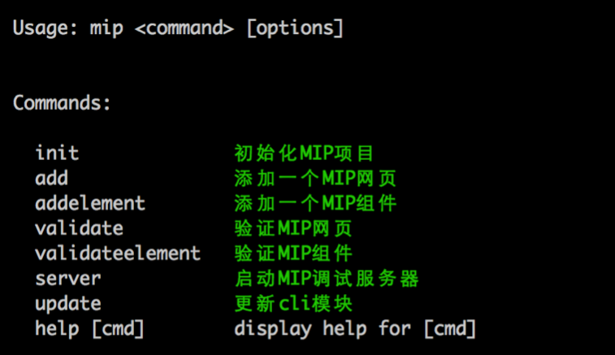
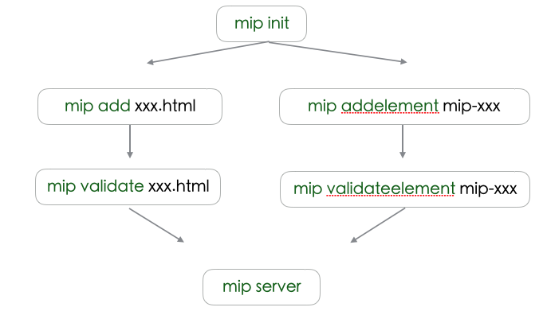

mip cli 工具集成了页面创建、组件创建、mip页面调试、mip组件调试、页面校验以及组件校验等功能，为mip相关开发和调试提供支持。

---

**常用命令**



基本调试过程



**安装**

依赖环境: [Node.js](https://nodejs.org/en/) (>=4.x).

``` bash
$ [sudo] npm install -g mip-cli
```
直接从官方安装，可能会由于网络原因，导致安装时间较长或安装失败。此时我们可以选择速度更快的 registry。

```
$ [sudo] npm install -g mip-cli --registry=https://registry.npm.taobao.org
```


*注意：*

nodejs 5.x, 6.x 安装模块时，可能会报`node-gyp`相关错误，需要使用如下命令安装

```
$ [sudo] npm install --unsafe-perm -g mip-cli
```
nodejs 5.x 安装`bufferutil`模块时可能会报编译错误，建议使用`4.4`或者`6.x`以上版本。


**相关ISSUES地址：**

https://github.com/mipengine/mip-cli/issues


**相关文档**

1. [调试mip网页](./debug-mip-page.md)
2. [调试mip组件](./debug-mip-extensions.md)
3. [调试mip网页](./debug-mip-page.md)

