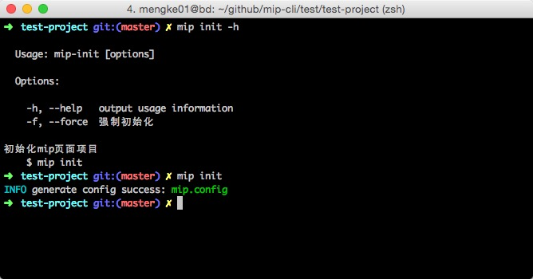
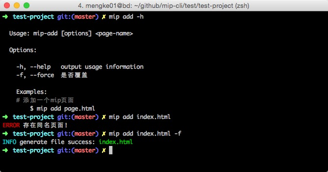
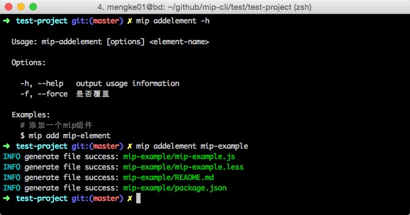
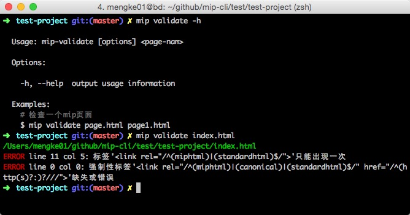
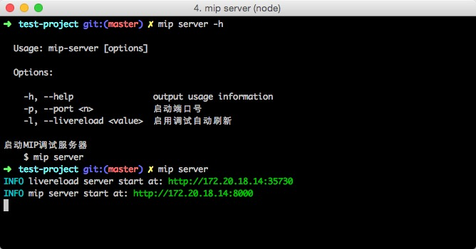
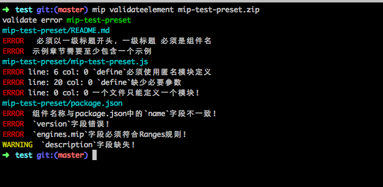
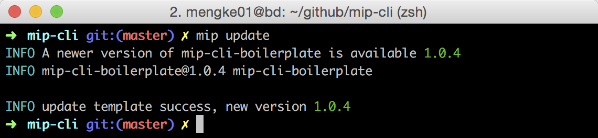

# MIP CLI 工具

MIP脚手架.

### 安装

依赖环境: [Node.js](https://nodejs.org/en/) (>=4.x).

``` bash
$ [sudo] npm install -g mip-cli
```
*注意：*
nodejs 5.x, 6.x 安装模块时，可能会报`node-gyp`相关错误，需要使用如下命令安装

```
$ [sudo] npm install --unsafe-perm -g mip-cli
```
nodejs 5.x 安装`bufferutil`模块时可能会报编译错误，建议使用`4.4`或者`6.x`以上版本。

### 使用

在当前项目`根目录`中初始化mip配置：

``` bash
$ mip init
```
会创建`mip.config`文件，相关配置如下：

```
module.exports = {

    /**
     * mip server调试的端口号
     *
     * @type {number}
     */
    port: 8000,

    /**
     * 本地mip网页后缀名，会对mip网页动态添加调试脚本
     *
     * @type {RegExp}
     */
    mipPageExt: /\.(?:html|htm|mip)$/i,

    /**
     * 本地mip组件调试目录，主要用于开发组件时进行本地调试，自动将本地mip组件注入到当前访问的页面中
     * 例如：配置'../mip-extensions'，会将此目录的组件注入到调试页面
     *
     * @type {string}
     */
    extensionsDir: '',

    /**
     * 本地mip调试目录，用于调试本地mip项目
     *
     * @type {string}
     */
    mipDir: '../../../mip',

    /**
     * 启用调试页面自动刷新
     *
     * @type {boolean}
     */
    livereload: true
};
```



----
在当前项目创建一个mip模板网页：

``` bash
$ mip add index.html
```



----
在`mip-extensions`仓库中创建一个mip组件：

``` bash
$ mip addelement mip-demo
```



----
验证mip网页：

``` bash
$ mip validate index.html [...]
```



----
在当前项目或者`mip-extensions`仓库中启动mip网页调试器：

``` bash
$ mip server
```

注意：调试`mip-extensions`仓库组件时，会读取组件中`READEME.md`的使用示例，因此组件的`README.md`中
应至少包含一段使用示例：
<pre>
    使用示例
    ```html
        &lt;mip-xxx&gt;&lt;/mip-xxx&gt;
    ```
</pre>

配置了`mipDir`之后可以调试`mip`引擎。

`mip server` 启动多个实例的话会报端口占用错误，需要关闭其他实例或者kill掉占用端口的进程后再启动。

```
➜  ~ mip server
INFO livereload server start at: http://172.20.128.110:35730
ERROR PORT 8000 already in use, please retry again!
```



----
在当前项目中，校验编写的mip组件，可以校验mip组件目录或者mip组件压缩包：

``` bash
# directory
$ mip validateelement ./mip-demo
# zip package
$ mip validateelement ./mip-demo.zip
```



----
更新mip工具，将mip模板更新到最新版本：

``` bash
$ mip update
```



----

直接从官方 npm registry 安装，可能会由于网络原因，导致安装时间较长或安装失败。此时我们可以选择速度更快的 registry。

```
$ [sudo] npm install -g mip-cli --registry=https://registry.npm.taobao.org
```

### 预览组件

进入`mip-extensions`仓库，使用`mip server`命令启动调试器
访问` http://127.0.0.1:8000`查看看组件列表，点击组件链接进行预览

### License

[MIT](http://opensource.org/licenses/MIT)


