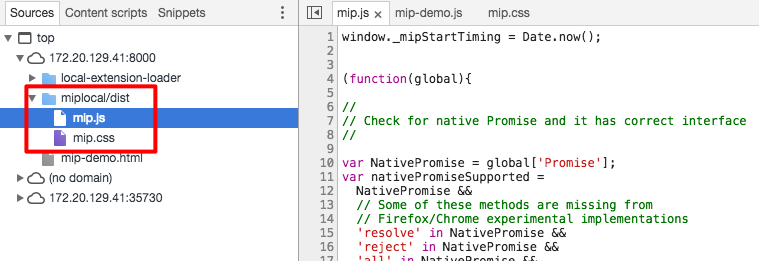

调试mip框架
---

配置mip框架目录可以进行mip主框架的调试。

1. 下载mip主框架代码

```
$ git clone https://github.com/mipengine/mip.git
$ cd mip && npm install
```

2. 配置项目中的`mip.config`，设置`mipDir`字段为mip主框架目录

```
    /**
     * 本地mipmain调试目录，用于调试本地mipmain项目
     *
     * @type {string}
     */
    mipDir: '../mip',
```

3. 启动`mip server` 查看调试的页面，可以看到主框架代码已经使用本地的了




