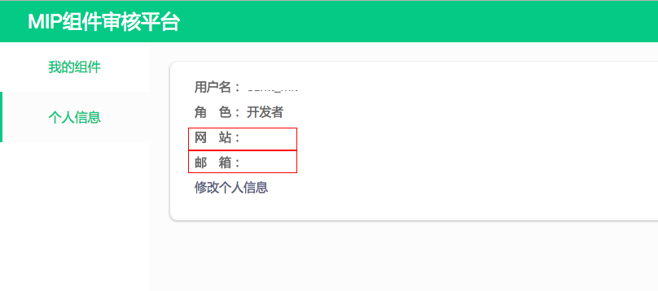
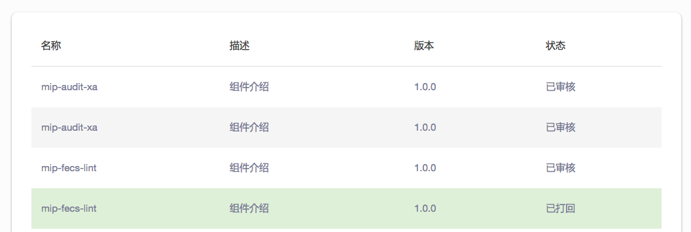

mip组件审核平台
---

使用组件审核平台上传mip组件，经过自动校验之后，提交平台审核，通过审核的组件会定时推送到线上，供网站使用。

## 使用说明

### 登录平台

使用｀百度帐号｀登录组件平台，登录成功之后需要设置自己的个人信息，以便于组件上线之后通知组件所有人。

### 上传组件

点击`上传组件`按钮，上传mip组件`zip`压缩包，mip组件编写和调试，参考[调试mip组件](https://github.com/mipengine/mip-cli/wiki/%E8%B0%83%E8%AF%95mip%E7%BB%84%E4%BB%B6)。

组件`zip`压缩包格式参考[组件压缩包示例](./example/mip-test.zip)

组件通过校验后，可以提交审核，没有通过校验的组件，需要进行修改，直到通过校验。

### 审核组件

组件提交审核之后会被锁定，不能再进行上传或修改，需要管理员通过审核或者打回之后才能继续修改，管理员打回的组件，
需要根据打回原因进行相应修改后再提交。

### 上线组件

组件通过审核后，会在下一个上线窗口进行上线，组件上线之后，在本地可以引入上线后的组件进行验证，
用户可以在`组件提交记录`页面查看组件版本审核历史。

